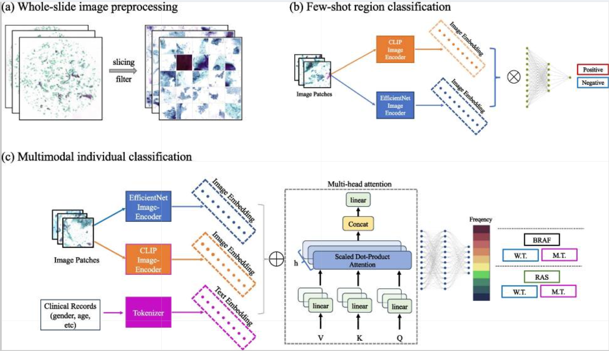

# Annotation-free genetic mutation estimation of thyroid cancer using cytological slides from multi-centers

This repository contains the official implementation for reproducing the results in the paper **"Annotation-free genetic mutation estimation of thyroid cancer using cytological slides from multi-centers"**.

```
Xiong, S., Liu, S., Zhang, W. et al. Annotation-free genetic mutation estimation of thyroid cancer using cytological slides from multi-centers. Diagn Pathol 20, 22 (2025). https://doi.org/10.1186/s13000-025-01618-1

```


## Project Structure

The codebase is organized into three main components:
- **`regionCls/`**: Patch-level classification pipeline for estimating informative regions.
- **`geneInstCls/`**: Instance-level classification pipeline for estimating genetic mutations (e.g., BRAF, RAS).
- **`geneEnsemble/`**: Evaluation and ensembling logic for gene mutation predictions.
- **`scripts/`**: Bash scripts for running the full training/inference pipelines and Python scripts for visualization.
- **`checkpoint/`**: Directory for storing trained model weights.
- **`logs/`**: Training logs and execution history.

## Getting Started

### Prerequisites

- Python 3.x
- PyTorch
- scikit-learn
- pandas
- numpy

### Running the Pipelines



#### 0. Informative Region Estimation (Region-level)
To run the region-level classification pipeline:
```bash
bash scripts/region-all_in_one.sh
```

#### 1. Gene Mutation Estimation (Gene-level)
To run the full k-fold cross-validation for gene mutation classification and ensembling:
```bash
bash scripts/gene-all_in_one.sh
```


## Visualization

The `scripts/` directory contains several tools for analyzing results:
- `vis_roc_curve.py`: Generate ROC curves for model evaluation.
- `vis_proba_map.py`: Visualize prediction probability maps.
- `vis_cluster_anno.py`: Visualize cluster annotations.

---
*Note: This project is currently under review.*
